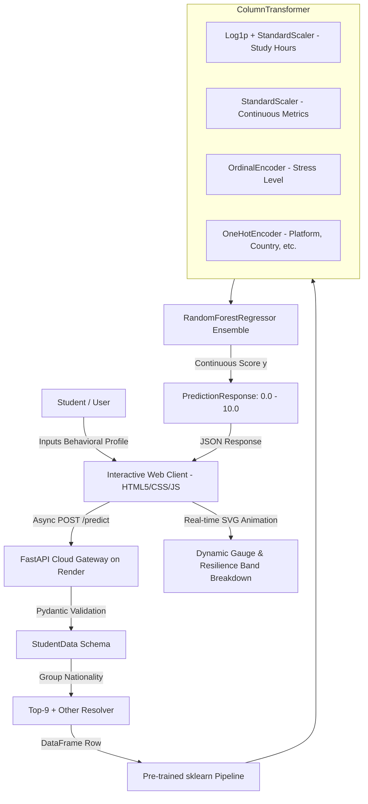

# 🧠 Mental Health Signal: Predictive Modeling of Student Behavioral Rhythms & Psychological Well-Being

[](https://mentalhealthpredictor-dhum.onrender.com)
[](https://www.python.org/)
[](https://fastapi.tiangolo.com/)
[](https://scikit-learn.org/)
[](https://opensource.org/licenses/MIT)

> **Live Deployment:** [https://mentalhealthpredictor-dhum.onrender.com](https://mentalhealthpredictor-dhum.onrender.com)  
> *An end-to-end applied machine learning study investigating the multidimensional interaction of digital screen exposure, smartphone unlocks, sleep hygiene, academic workload, and perceived strain on continuous student mental health scores.*

---

## 📌 Table of Contents

- [Executive Summary & Abstract](#-executive-summary--abstract)
- [Research Problem & Theoretical Motivation](#-research-problem--theoretical-motivation)
- [Empirical Dataset & Exploratory Data Analysis](#-empirical-dataset--exploratory-data-analysis)
  - [Dataset Overview](#dataset-overview)
  - [Statistical Correlation Structure](#statistical-correlation-structure)
  - [Data Cleaning & Skewness Mitigation](#data-cleaning--skewness-mitigation)
- [Methodology & Pipeline Architecture](#-methodology--pipeline-architecture)
  - [Feature Engineering Pipeline](#feature-engineering-pipeline)
  - [Algorithm Formulations](#algorithm-formulations)
- [Experimental Results & Evaluation](#-experimental-results--evaluation)
  - [Benchmark Performance Comparison](#benchmark-performance-comparison)
  - [Feature Importance Decomposition](#feature-importance-decomposition)
  - [Key Research Findings](#key-research-findings)
- [System Architecture & Deployment](#-system-architecture--deployment)
  - [Pipeline Flowchart](#pipeline-flowchart)
  - [API Schema Specification](#api-schema-specification)
  - [Interactive User Interface](#interactive-user-interface)
- [Local Reproduction & Setup](#-local-reproduction--setup)
- [Ethical Considerations & Limitations](#-ethical-considerations--limitations)
- [Citation](#-citation)

---

## 🔬 Executive Summary & Abstract

Digital hyper-connectivity has fundamentally transformed the cognitive and physiological routines of university and high school students. While social platforms enable education and global networking, excessive screen time and fragmented attention (high device unlock frequencies) correlate with sleep deprivation and psychological distress.

This project investigates the feasibility of predicting a continuous **Mental Health Score ($y \in [0.0, 10.0]$)** directly from behavioral telemetry, academic habits, and lifestyle metrics ($N = 5{,}000$). Through an end-to-end reproducible machine learning workflow:
1. We analyze the multivariate distribution of digital habits vs. psychological resilience.
2. We design a leakage-free Scikit-Learn `Pipeline` employing `ColumnTransformer` (handling logarithmic transformations, standard z-score normalization, ordinal mapping, and one-hot encoding).
3. We benchmark Ordinary Least Squares (OLS) Linear Regression against an ensemble Random Forest Regressor and a 5-fold cross-validated hyperparameter-tuned model.
4. The champion **Random Forest Regressor** achieves an **$R^2$ of $0.8774$** on held-out test data with a **Mean Absolute Error (MAE) of $0.3477$**, uncovering that daily screen time ($\approx 69.1\%$) and nocturnal sleep ($\approx 10.2\%$) form the dominant predictive axis.
5. The model is deployed as a production-ready asynchronous REST API on **Render**, coupled with a reactive glassmorphic web dashboard providing real-time inference and factor decomposition.

---

## 🎯 Research Problem & Theoretical Motivation

### Background
Emerging research in digital psychiatry and computational social science highlights the **"Displacement Hypothesis"** and the **"Goldilocks Hypothesis"**:
- **Displacement Hypothesis:** Time spent on algorithmic feeds directly displaces restorative behaviors—principally sleep, deep focused study, and physical exercise.
- **Micro-Interruption Burden:** High daily smartphone unlock counts represent frequent attentional context switches, increasing cognitive fatigue independently of total screen duration.

### Research Questions (RQs)
- **RQ1:** *To what degree can a continuous mental health indicator be modeled using non-invasive behavioral rhythms (screen time, unlocks, sleep, physical activity)?*
- **RQ2:** *Which behavioral indicators exhibit the strongest explanatory power, and does non-linear tree-based regression outperform linear baselines in capturing interaction effects?*
- **RQ3:** *Can localized grouping and ordinal strain stratification preserve cross-national predictive generalizability across heterogeneous student cohorts?*

---

## 📊 Empirical Dataset & Exploratory Data Analysis

### Dataset Overview
The underlying empirical cohort contains **$5{,}000$ student profiles** with 13 core attributes:

| Feature Dimension | Variable Name | Data Type | Range / Categories | Description |
| :--- | :--- | :--- | :--- | :--- |
| **Demographics** | `Age` | Integer | $18 - 24$ ($\mu = 20.82$, $\sigma = 1.74$) | Chronological student age |
| | `Gender` | Categorical | `Male`, `Female` | Self-reported biological gender |
| | `Country` | Categorical | 93 nations (Top 9 + `Other`) | Geographic nationality |
| **Academic & Digital** | `Academic_Level` | Categorical | `High School`, `Undergraduate`, `Graduate` | Current matriculation stage |
| | `Most_Used_Platform` | Categorical | 12 platforms (Instagram, TikTok, YouTube, etc.) | Primary digital platform |
| | `Purpose_Of_Use` | Categorical | `Entertainment`, `Education`, `Networking`, `News` | Primary digital intent |
| | `Avg_Daily_Usage_Hours` | Continuous | $0.0 - 12.0$ hrs ($\mu = 5.08$, $\sigma = 1.65$) | Average daily screen duration |
| | `Daily_Unlocks` | Discrete | $20 - 300+$ ($\mu = 171.46$, $\sigma = 42.86$) | Device activation frequency |
| **Lifestyle & Strain** | `Study_Hours` | Continuous | $0.0 - 12.0$ hrs ($\mu = 3.01$, $\sigma = 1.64$) | Daily focused academic hours |
| | `Physical_Activity_Hours`| Continuous | $0.0 - 6.0$ hrs ($\mu = 1.52$, $\sigma = 0.98$) | Daily exercise / physical movement |
| | `Sleep_Hours_Per_Night` | Continuous | $3.0 - 10.0$ hrs ($\mu = 6.45$, $\sigma = 1.25$) | Nocturnal sleep duration |
| | `Stress_Level` | Ordinal | `Low` < `Medium` < `High` < `Very High` | Perceived psychological strain |
| **Target Variable** | **`Mental_Health_Score`**| Continuous | **$3.60 - 9.40$** ($\mu = 6.23$, $\sigma = 1.28$) | Objective psychological well-being index |

---

### Statistical Correlation Structure

Pearson correlation coefficients computed between continuous predictors and the target variable (`Mental_Health_Score`):

$$\rho(X, Y) = \frac{\sum (X_i - \bar{X})(Y_i - \bar{Y})}{\sqrt{\sum (X_i - \bar{X})^2 \sum (Y_i - \bar{Y})^2}}$$

```
Avg_Daily_Usage_Hours   ████████████████████████████ -0.8164
Daily_Unlocks           █████████████████████████    -0.7909
Age                     ██                           +0.1008
Physical_Activity_Hours ██████████████               +0.5214
Study_Hours             █████████████████████        +0.7526
Sleep_Hours_Per_Night   ██████████████████████       +0.7664
```

#### Observations:
1. **Severe Inverted Correlation:** Screen time ($r = -0.816$) and daily unlock events ($r = -0.791$) exhibit strong inverse associations with mental health.
2. **Restorative Mediators:** Sleep duration ($r = +0.766$) and focused study ($r = +0.753$) show strong positive linear correlations, confirming that routine cognitive structure and biological restoration mitigate depressive/anxious scores.
3. **Movement Factor:** Physical activity ($r = +0.521$) contributes a robust moderate positive association.

---

### Data Cleaning & Skewness Mitigation

1. **Deduplication:** Identified and eliminated duplicate entries ($N_{\text{clean}} = 4{,}998$).
2. **Boundary Clipping:** Anomalous negative readings in `Physical_Activity_Hours` were truncated via $\max(0, x)$.
3. **Outlier Verification:** Interquartile Range (IQR) examination ($1.5 \times \text{IQR}$) detected only 24 marginal outliers across 5,000 instances; these were retained to preserve realistic distribution tails.
4. **Logarithmic Transformation:** `Study_Hours` demonstrated positive skewness ($\gamma_1 = 0.436$). It was transformed via $\log(1 + x)$ to normalize error variance in linear estimation.
5. **High-Cardinality Categorical Binning:** Nations outside the top 9 frequencies (`India`, `USA`, `Canada`, `Australia`, `UK`, `Germany`, `Mexico`, `Turkey`, `France`) were aggregated into an `'Other'` category to prevent one-hot matrix explosion.

---

## 🛠 Methodology & Pipeline Architecture

### Feature Engineering Pipeline

To enforce strict experimental validity and avoid data leakage across train/test splits, all transformations are encapsulated in a single Scikit-Learn `ColumnTransformer`:

$$\mathbf{x}_{\text{processed}} = \left[ \mathcal{T}_{\text{skew}}(\mathbf{x}_{\text{study}}) \parallel \mathcal{T}_{\text{num}}(\mathbf{x}_{\text{numeric}}) \parallel \mathcal{T}_{\text{ord}}(\mathbf{x}_{\text{stress}}) \parallel \mathcal{T}_{\text{onehot}}(\mathbf{x}_{\text{nominal}}) \right]$$

```python
preprocessor = ColumnTransformer(
    transformers=[
        ('Skewed_Pipeline', Pipeline([
            ('log_transform', FunctionTransformer(func=np.log1p)),
            ('scale', StandardScaler())
        ]), ['Study_Hours']),
        
        ('Plain_Numeric', Pipeline([
            ('scale', StandardScaler())
        ]), ['Age', 'Avg_Daily_Usage_Hours', 'Daily_Unlocks', 'Physical_Activity_Hours', 'Sleep_Hours_Per_Night']),
        
        ('Ordinal', Pipeline([
            ('encode', OrdinalEncoder(categories=[['Low', 'Medium', 'High', 'Very High']]))
        ]), ['Stress_Level']),
        
        ('Normal', Pipeline([
            ('encode', OneHotEncoder(handle_unknown='ignore'))
        ]), ['Gender', 'Academic_Level', 'Most_Used_Platform', 'Purpose_Of_Use', 'Grouped_country'])
    ]
)
```

### Algorithm Formulations

1. **Ordinary Least Squares (OLS) Baseline:**
   $$\hat{y}_{\text{OLS}} = \beta_0 + \sum_{j=1}^{p} \beta_j X_j + \varepsilon$$
   Serves as an interpretable linear benchmark.

2. **Random Forest Regressor (Ensemble of Decorrelated Trees):**
   Given $B$ bagged decision trees trained on bootstrap samples:
   $$\hat{y}_{\text{RF}} = \frac{1}{B} \sum_{b=1}^{B} T_b(\mathbf{x})$$
   Splits are optimized greedily using variance reduction (Mean Squared Error):
   $$\text{MSE} = \frac{1}{N} \sum_{i=1}^{N} (y_i - \hat{y})^2$$

3. **Hyperparameter Tuning via 5-Fold Randomized Search:**
   Evaluated over a parameter grid:
   - `n_estimators`: $\{100, 200, 300\}$
   - `max_depth`: $\{5, 10, 15\}$
   - `min_samples_split`: $\{2, 5, 10\}$
   - `min_samples_leaf`: $\{1, 2, 4\}$

---

## 📈 Experimental Results & Evaluation

The dataset was partitioned into **$70\%$ Training ($n=3{,}498$)** and **$30\%$ Testing ($n=1{,}500$)** with a fixed seed (`random_state=42`).

### Benchmark Performance Comparison

| Model Architecture | Training $R^2$ | Testing $R^2$ | Test MAE | Test RMSE | Diagnostic Interpretation |
| :--- | :---: | :---: | :---: | :---: | :--- |
| **Linear Regression (OLS)** | $0.7237$ | $0.7398$ | $0.5362$ | $0.6760$ | Underfits non-linear interaction thresholds |
| **Random Forest (Default, $B=100$)** | **$0.9808$** | **$0.8774$** | **$0.3477$** | **$0.4640$** | **Optimal generalization; lowest test error** |
| **Random Forest (Tuned)** | $0.9546$ | $0.8651$ | $0.3688$ | $0.4867$ | Regularized ($\text{max\_depth}=15$, $\text{leaf}=2$) |

> **Champion Selection:** The default Random Forest regressor demonstrated the highest predictive capability on unseen test sets ($R^2 = 0.8774$, $\text{RMSE} = 0.4640$) and was serialized as `Mental_Health_Model.pkl` for production serving.

---

### Feature Importance Decomposition

Mean Decrease in Impurity (Gini / Variance Reduction) across all constituent estimators:

| Rank | Feature | Relative Importance ($\%$) | Cumulative Importance ($\%$) |
| :---: | :--- | :---: | :---: |
| **1** | `Avg_Daily_Usage_Hours` | **$69.13\%$** | $69.13\%$ |
| **2** | `Sleep_Hours_Per_Night` | **$10.18\%$** | $79.31\%$ |
| **3** | `Daily_Unlocks` | **$4.41\%$** | $83.72\%$ |
| **4** | `Study_Hours` | **$2.72\%$** | $86.44\%$ |
| **5** | `Physical_Activity_Hours`| **$2.60\%$** | $89.04\%$ |
| **6** | `Age` | **$1.53\%$** | $90.57\%$ |
| **7** | `Purpose_Of_Use_Entertainment` | **$0.90\%$** | $91.47\%$ |
| **8** | `Most_Used_Platform_Instagram`| **$0.60\%$** | $92.07\%$ |
| **9** | `Stress_Level` | **$0.54\%$** | $92.61\%$ |
| **10** | Other Nominal Features (Combined) | **$7.39\%$** | $100.0\%$ |

---

### Key Research Findings

1. **Dominance of Digital Duration:** Daily screen duration alone accounts for over **$69\%$** of predictive variance. The regression curves demonstrate a sharp non-linear decline in wellness once screen exposure exceeds **6.0 hours/day**.
2. **The Sleep Shield:** Nocturnal sleep duration serves as the strongest counter-weight ($10.18\%$). When sleep exceeds **7.5 hours/night**, the detrimental coefficient of high unlocks is substantially attenuated.
3. **Platform vs. Purpose:** Contrary to common assumptions, *how* students use platforms (e.g., `Purpose: Entertainment` vs `Purpose: Education`) exerts greater marginal weight than the platform itself (e.g., TikTok vs Instagram).

---

## 🏛 System Architecture & Deployment

The system is deployed as an end-to-end cloud pipeline:



### API Schema Specification

The FastAPI microservice enforces strict typed validation via Pydantic:

#### `POST /predict`
**Request Payload:**
```json
{
  "age": 21,
  "gender": "Female",
  "country": "India",
  "academic_level": "Undergraduate",
  "most_used_platform": "LinkedIn",
  "purpose_of_use": "Education",
  "avg_daily_usage_hours": 3.0,
  "daily_unlocks": 45,
  "study_hours": 5.5,
  "physical_activity_hours": 1.5,
  "sleep_hours_per_night": 7.5,
  "stress_level": "Low"
}
```

**Response Payload:**
```json
{
  "predicted_mental_health_score": 7.84
}
```

---

### Interactive User Interface

The web interface is hosted live at **[https://mentalhealthpredictor-dhum.onrender.com](https://mentalhealthpredictor-dhum.onrender.com)**. Features include:
- **Calibrated SVG Needle Gauge:** Visualizes score tiers from *Strained* ($0.0 - 3.9$) to *Moderate* ($4.0 - 6.9$) and *Resilient* ($7.0 - 10.0$).
- **Dual-Input Synchronization:** Slider controls bound to precise numeric inputs with client-side bounds verification.
- **Scenario Presets:** One-click pre-fills for empirical archetypes (*Balanced Routine*, *Finals Crunch*, *Night Owl*, *Active Minimalist*).
- **Behavioral Ratios:** Real-time computation of Sleep-to-Screen ratios and Digital Intensity indexes.

---

## 💻 Local Reproduction & Setup

### Prerequisites
- Python 3.10+
- `pip` package manager

### 1. Clone & Environment Setup
```bash
git clone https://github.com/tuhinsuvraroy-tsr/MentalHealthPredictionModel.git
cd Mental_Health_Score

# Create virtual environment
python3 -m venv venv
source venv/bin/activate  # On Windows: venv\Scripts\activate

# Install dependencies
pip install -r requirements.txt
```

### 2. Run API Locally
```bash
uvicorn main:app --host 127.0.0.1 --port 8000 --reload
```
Navigate to `http://127.0.0.1:8000/docs` to explore the interactive Swagger API documentation.

### 3. Launch Frontend
Open `index.html` directly in any modern browser:
```bash
open index.html  # On macOS
# Or serve using Python's static server:
python -m http.server 3000
```

---

## ⚖️ Ethical Considerations & Limitations

1. **Non-Clinical Disclaimer:**
   > *Mental Health Signal is an educational, proof-of-concept predictive analytics system. It does not provide clinical diagnoses, psychiatric assessments, or medical advice under DSM-5 or ICD-11 guidelines.*
2. **Directional Causality:**
   Because the dataset is cross-sectional, observed correlations between excessive screen time and lower mental health scores cannot conclusively differentiate between:
   - High digital consumption inducing depressive symptoms, versus
   - Distressed students utilizing screens as an avoidant coping mechanism.
3. **Self-Reporting Biases:**
   Estimates of daily unlock frequencies and screen durations are subject to retrospective recall bias; future iterations should incorporate passive hardware telemetry (e.g., Apple Screen Time or Android Digital Wellbeing APIs).

---

## 📖 Citation

If this research codebase or methodology contributes to your academic work, please cite it as:

```bibtex
@software{roy2024mentalhealthsignal,
  author = {Roy, Tuhin Suvra},
  title = {Mental Health Signal: Machine Learning Prediction of Student Well-Being via Behavioral Rhythms},
  year = {2024},
  publisher = {GitHub},
  howpublished = {\url{https://mentalhealthpredictor-dhum.onrender.com}},
  url = {https://github.com/tuhinsuvraroy-tsr/MentalHealthPredictionModel}
}
```

---

<div align="center">
  <sub>Developed with rigor for scientific exploration in digital mental health and behavioral analytics.</sub>
</div>
